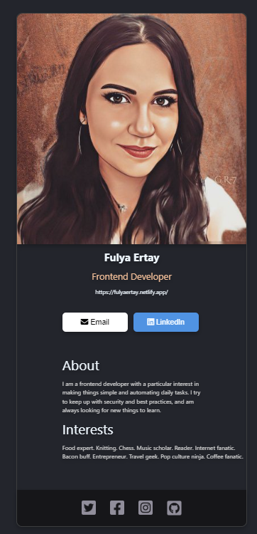
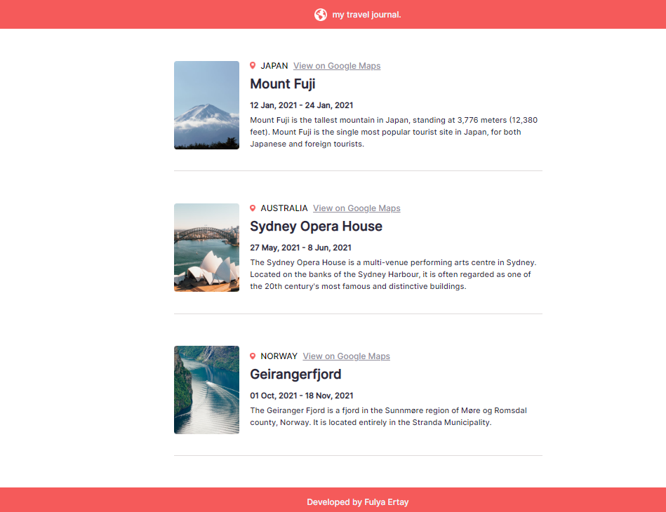
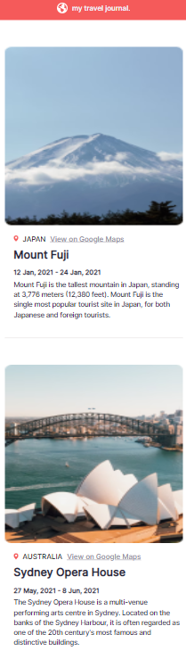
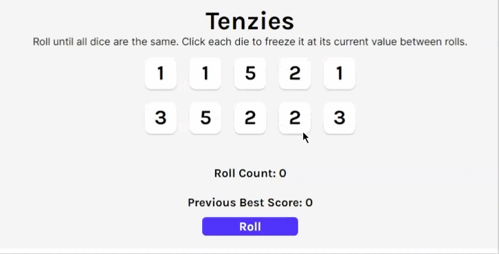

## Table of contents

- [Overview](#overview)

- [Projects](#projects)

  - [1-First React Site](#1-first-react-site)
  - [2-Digital Business Card](#2-digital-business-card)
  - [3-AirBnb Clone App](#3-airbnb-clone-app)
  - [4-Travel Journal App](#4-travel-journal-app)
  - [5-Meme Generator App](#5-meme-generator)
  - [6-Notes App](#6-notes-app)
  - [7-Tenzies App](#7-tenzies-app)
  - [8-Quiz App](#8-quiz-app)

    
  ## Overview

  Completed these projects that are parts of [Scrimba](https://scrimba.com/learn/frontend/)'s React Basics Course. I learned fundamentals of React in these projects.
  You can see the visual representations of the each app below.

  ## Projects

  ### 1-First React Site

  ### Visualization of the app;
  
  
  ### Description
  
  I created a first static webpage with react.
  
  ### 2-Digital Business Card : [Live Link](https://fulyaertay-digital-business-card.netlify.app/)

  ### Visualization of the app;
  
  
  ### Description
  
  I created a static solo project called as digital business card with three components.
  - Header component consists of;
    - An image,
    - Name & job title
    - Action buttons
  - Main component consists of;
    - About & interests contents
  - Footer component consists of;
    - Social media icons
  
  ### What I Learned?
  - Why React?
  - JSX
  - Custom Components
  - Styling
  - Static pages
  
  
  ### 3-AirBnb Clone App

  ### Visualization of the app;
  
  
  ### Description
  
  I created static page for AirBnb experiences clone app with three components.
  - Navbar component consists of;
    - AirBnb logo,
    - Navbar
  - Hero component consists of;
    - Hero image
    - Hero header & hero text
  - Card component consists of;
    - Card lists including user views
  
  ### 4-Travel Journal App : [Live Link](https://travel-journal-static-site.netlify.app/)

  ### Visualization on the Desktop;
  
  
  ### Visualization on the Mobile;
  
  
  ### Description
  
  I created a static solo project called as travel journal app with two components.
  - Header component consists of;
    - Navbar including logo and site name
  - Places component consists of;
    - Place image
    - Place location when clicked "View on Google Maps"
    - Travel date
    - Place description
  - Footer component
    
  ### What I Learned?
  - Props in React
  - Mapping data
  - && operator as short way of if statement

  ### 5-Meme Generator App : [Live Link](https://react-site-meme-generator.netlify.app/)

  ### Visualization on the App;
  
 
  
  ### Description
  
  I created first interactive React project called as Meme Generator. The app features include;
  - User can get random image by clicking button
  - User can adjust top/bottom texts on the image when typing
  - The app uses an Image API on https://api.imgflip.com/get_memes
    
  ### What I Learned?
  - Event listeners
  - States
  - Conditional rendering
  - React forms
  - Side effects and useEffect() hook also cleanup function
  
  
  ### 6-Notes App : [Live Link](https://scrimba-notes-app-react.netlify.app/)

  ### Visualization on the App;
  
 
  
  ### Description
  
  I created second React project called as Note App. The app features include;
  - User can create new note
  - User can edit notes on mardown editor also see preview
  - Delete notes on sidebar
  - React libraries such as react-split, react-mde
  
  
  ### 7-Tenzies App : [Live Link](https://fe-tenzies-app.netlify.app/)

  ### Visualization on the App;
  
 
  
  ### Description
  
  I created interactive game app called as Tenzies. The app features include;
  - User can start new game
  - User can see total number of rolls 
  - User can roll dice until all other dices are same
  - If all dices are same, user can win!
  - User can see the previous best score.
  - Local storage to save the previous best score according to all dices are same for example;
    - All dices are 6 then total previous score is 60 or dices are 1 then total previous score is 10 etc.
  
  ### What I Learned?
  - .every() method
  - nanoid()
  - react-confetti
    
  ### 8-Quiz App : [Live Link](https://scrimba-quiz-app.netlify.app/)

  ### Visualization on the App;
  
 
  
  ### Description
  
  I created interactive quiz app. The app features include;
  - User can start quiz
  - The five questions are listed using [The Trivia API](https://the-trivia-api.com/api/questions?limit=5&region=TR&difficulty=easy&type=multiple)
  - Tally correct answers and total score after User clicks "Check answers" button

